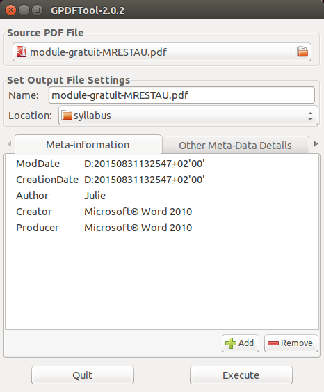

GPDFTool
================

Gnome GUI to edit PDF metadata (via pdftk). Developped by [AnsuzPeorth](http://forum.ubuntu-fr.org/viewtopic.php?id=410841).

Good alternatives: [PDFMtEd](https://github.com/Glutanimate/PDFMtEd) and [PDF Chain](http://pdfchain.sourceforge.net/).

Requirements
------------
- Gnome (GTK, pygtk> 2.6, python> 2.5)
- pdftk  (install with ``sudo apt-get install pdftk``)

Usage
-------
[Download](https://github.com/berteh/gnome-pdf-tool/archive/master.zip), decompress (for instance in ~/bin) and then

Either run from console (PDF input file is optional)

    cd <your GPDTFool download location> && ./go_GPDFTool.sh [input.pdf]

Or install as a nautilus script with the commands below, the right click on a pdf file in nautilus and select ``Script > Edit PDF Metadata``

    cd <your GPDTFool download location>/nautilus-script/
    ./install_nautillus-script.sh
    nautilus ~/.local/share/nautilus/scripts/ &

More complete documentation, screenshots and how-to is available in [Gayan's review of GPDFTool](http://www.hecticgeek.com/2012/01/simple-pdf-metadata-editor-ubuntu-linux/).
      
Features
---------
  - Edit metadata (InfosValues ​​& InfoKeys)
  - Rights Management
  - Password Management

Screenshot
---------

  
License
---------
[GNU GPL v3](http://www.gnu.org/licenses/gpl.html)

Changelog
----------
2015/09/04

- Forked to github due to [Google Code](http://code.google.com/p/gnome-pdf-tool/) discontinuation
- update for Ubuntu 14.04

2012/04/04

- English translation added by Gayan - http://www.hecticgeek.com
- Working with Ubuntu Lucid 10.4
- New version of glade2script (2.4.3)

2010/08/04

- Initial French version for Ubuntu Hardy (8.04), by AnsuzPeorth - http://forum.ubuntu-fr.org/viewtopic.php?id=410841
